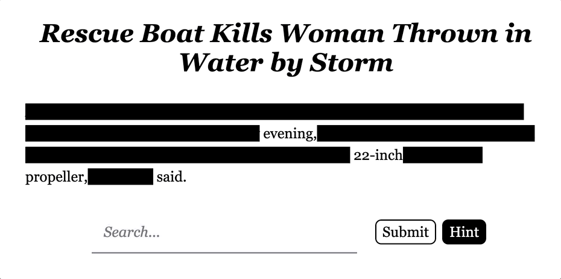

# Redacted

Live site: https://nytimes-redacted.herokuapp.com

## Overview

This was my final project created during my last week at SPICED Academy.

Redacted is a daily word puzzle that utilizes the [New York Times Archive API](https://developer.nytimes.com/docs/archive-product/1/overview). 

Each day at midnight, Berlin time, the app calls the Archive API and selects a random news story. The lead paragraph is then stored as a JSON file and served to each user on load. The text is obfuscated ([currently, using a uhh... less than sophisticated method](https://github.com/darrylleung/nytimes-redacted/blob/main/misc/very-secure-obfuscation.png?raw=true), more on this later) to create a puzzle. The headline of the story and all words with punctuation are revealed as initial context. The goal is for the user to reveal the entire puzzle in as few guesses as possible 

The Hint button randomly reveals one obfuscated word and can be used whenever the user is stuck. 

When the entire puzzle is revealed, a component shows the headline of the story, the byline and link to the full New York Times story, and the user's final score. The score is a combination of Guesses and Hints (weighed accordingly). A lower score is better.

Users can create an account or play the puzzle without. In the future, there will be a global leaderboard and registered users will be able to review past scores and access stories from previous puzzles.

## Tech Stack

JavaScript, React, node.js, Express, Axios, PostgreSQL, Heroku

## Improvements

This project was a lot of fun to hack together in a week, but it's unpolished and not yet ready for real world deployment.

- Better obfuscation with [baffle.js](https://camwiegert.github.io/baffle/). I stumbled upon [Redactle](https://www.redactle.com/) after I finished presenting my project and got the idea to use baffle.js for obfuscation at the DOM level rather than through CSS. 
- Better querying in the backend. The New York Times Archive API allows access to all articles going back to 1851. This sounds great (in theory) but many of those early articles are not fully digitized. Results generated from earlier parts of the archive lack headlines, leading paragraphs, etc. Currently, to cut down on inconsistency, the earliest articles can be pulled from are 1989. Generally, substantial improvements can be made to how articles are filtered.
- Implementation of a leaderboard. Puzzles can be fun, but they're more fun when you can measure your score against others.
- Allow users to choose 'categories' so there are multiple puzzles per day. 
